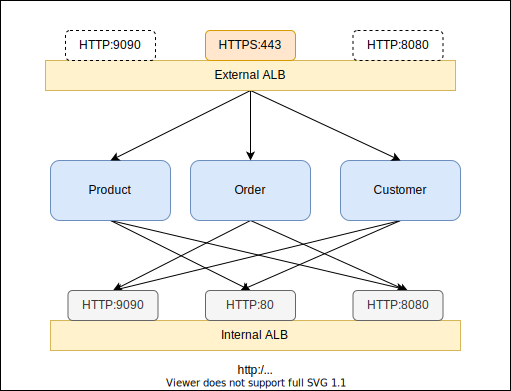

# serverless-container-constructs

CDK patterns for modern application with serverless containers on AWS

# `AlbFargateServices`

Inspired by _Vijay Menon_ from the [AWS blog post](https://aws.amazon.com/blogs/containers/how-to-use-multiple-load-balancer-target-group-support-for-amazon-ecs-to-access-internal-and-external-service-endpoint-using-the-same-dns-name/) introduced in 2019, `AlbFargateServices` allows you to create one or many fargate services with both internet-facing ALB and internal ALB associated with all services. With this pattern, fargate services will be allowed to intercommunicat via internal ALB while external inbound traffic will be spread across the same service tasks through internet-facing ALB.


The sample below will create 3 fargate services associated with both external and internal ALBs. The internal ALB will have an alias(`internal.svc.local`) auto-configured from Route 53 so services can communite through the private ALB endpoint.


```ts
import { AlbFargateServices } from 'serverless-container-constructs';

new AlbFargateServices(stack, 'Service', {
  spot: true, // FARGATE_SPOT only cluster
  tasks: [
    {
      listenerPort: 80,
      task: orderTask,
      desiredCount: 2,
      // customize the service autoscaling policy
      scalingPolicy: {
        maxCapacity: 20,
        requestPerTarget: 1000,
        targetCpuUtilization: 50,
      },
    },
    { listenerPort: 8080, task: customerTask, desiredCount: 2 },
    { listenerPort: 9090, task: productTask, desiredCount: 2 },
  ],
  route53Ops: {
    zoneName, // svc.local
    externalAlbRecordName, // external.svc.local
    internalAlbRecordName, // internal.svc.local
  },
});
```

## Fargate Spot Support

By enabling the `spot` property, 100% fargate spot tasks will be provisioned to help you save up to 70%. Check more details about [Fargate Spot](https://aws.amazon.com/about-aws/whats-new/2019/12/aws-launches-fargate-spot-save-up-to-70-for-fault-tolerant-applications/?nc1=h_ls). This is a handy catch-all flag to force all tasks to be `FARGATE_SPOT` only.

To specify mixed strategy with partial `FARGATE` and partial `FARGATE_SPOT`, specify the `capacityProviderStrategy` for individual tasks like

```ts
new AlbFargateServices(stack, 'Service', {
  tasks: [
    {
      listenerPort: 8080,
      task: customerTask,
      desiredCount: 2,
      capacityProviderStrategy: [
        {
          capacityProvider: 'FARGATE',
          base: 1,
          weight: 1,
        },
        {
          capacityProvider: 'FARGATE_SPOT',
          base: 0,
          weight: 3,
        },
      ],
    },
  ],
});
```
The custom capacity provider strategy will be applied if `capacityProviderStretegy` is specified, otherwise, 100% spot will be used when `spot: true`. The default policy is 100% Fargate on-demand.

## ECS Exec

Simply turn on the `enableExecuteCommand` property to enable the [ECS Exec](https://docs.aws.amazon.com/AmazonECS/latest/developerguide/ecs-exec.html) support for all services.

## Internal or External Only

By default, all task(s) defined in the `AlbFargateServices` will be registered to both external and internal ALBs. 
Set `accessibility` to make it internal only, external only, or both.

```ts
new AlbFargateServices(stack, 'Service', {
    tasks: [
      // this task is internal only
      { listenerPort: 8080, task: task1, accessibility: LoadBalancerAccessibility.INTERNAL_ONLY},
      // this task is external only
      { listenerPort: 8081, task: task2, accessibility: LoadBalancerAccessibility.EXTERNAL_ONLY},
      // this task is both external and internal facing(default behavior)
      { listenerPort: 8082, task: task3 },
    ],
  });
```

Please note if all tasks are defined as `INTERNAL_ONLY`, no external ALB will be created. Similarly, no internal ALB
will be created if all defined as `EXTERNAL_ONLY`.

## VPC Subnets

By default, all tasks will be deployed in the private subnets. You will need the NAT gateway for the default route associated with the private subnets to ensure the task can successfully pull the container images.

However, you are allowed to specify `vpcSubnets` to customize the subnet selection.

To deploy all tasks in public subnets, one per AZ:

```ts
new AlbFargateServices(stack, 'Service', {
    vpcSubnets: {
      subnetType: ec2.SubnetType.PUBLIC,
      onePerAz: true,
  },
  ...
});
```
This will implicitly enable the `auto assign public IP` for each fargate task so the task can successfully pull the container images from external registry. However, the ingress traffic will still be balanced via the external ALB.

To deploy all tasks in specific subnets:

```ts
new AlbFargateServices(stack, 'Service', {
  vpcSubnets: { 
      subnets: [
        ec2.Subnet.fromSubnetId(stack, 'sub-1a', 'subnet-0e9460dbcfc4cf6ee'),
        ec2.Subnet.fromSubnetId(stack, 'sub-1b', 'subnet-0562f666bdf5c29af'),
        ec2.Subnet.fromSubnetId(stack, 'sub-1c', 'subnet-00ab15c0022872f06'),
      ],
    },
  ...
});
```


## Sample Application

This repository comes with a sample applicaiton with 3 services in Golang. On deployment, the `Order` service will be exposed externally on external ALB port `80` and all requests to the `Order` service will trigger sub-requests internally to another other two services(`product` and `customer`) through the internal ALB and eventually aggregate the response back to the client.




## Deploy

To deploy the sample application in you default VPC:

```sh
// install first
yarn install
npx cdk diff -c use_default_vpc=1
npx cdk deploy -c use_default_vpc=1
```

On deployment complete, you will see the external ALB endpoint in the CDK output. `cURL` the external HTTP endpoint and you should be able to see the aggregated response.


```sh
$ curl http://demo-Servi-EH1OINYDWDU9-1397122594.ap-northeast-1.elb.amazonaws.com

{"service":"order", "version":"1.0"}
{"service":"product","version":"1.0"}
{"service":"customer","version":"1.0"}
```

## `cdk-nag` with `AwsSolutions` check

This construct follows the best practices from the [AWS Solutoins](https://github.com/cdklabs/cdk-nag/blob/main/RULES.md#awssolutions) with [cdk-nag](https://github.com/cdklabs/cdk-nag). Enable the `AWS_SOLUTIONS_CHECK` context variable to check aginst the cdk-nag rules.

```sh
npx cdk diff -c AWS_SOLUTIONS_CHECK=1
or
npx cdk synth -c AWS_SOLUTIONS_CHECK=1
```


## Security

See [CONTRIBUTING](CONTRIBUTING.md#security-issue-notifications) for more information.

## License

This library is licensed under the MIT-0 License. See the LICENSE file.

